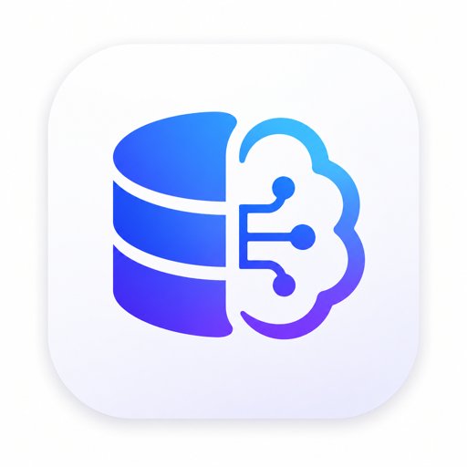

<p align="center">
  
</p>

<h1 align="center">DBMind</h1>

<p align="center">
  <strong>AI-powered database management desktop app</strong>
  <br />
  MySQL · PostgreSQL ｜ 多标签 SQL 编辑器 ｜ AI 智能生成 ｜ 数据编辑 ｜ 表结构设计
</p>

<p align="center">
  <a href="#下载">下载</a> ·
  <a href="#功能">功能</a> ·
  <a href="#本地开发">本地开发</a> ·
  <a href="#技术栈">技术栈</a> ·
  <a href="#许可">许可</a>
</p>

---

## 功能

- **AI SQL 生成** — 自然语言描述需求，AI 根据表结构自动生成 SQL。支持 OpenAI / Ollama / 兼容接口，流式响应，多轮对话上下文
- **多标签 SQL 编辑器** — Monaco Editor 内核，SQL 语法高亮、关键字补全、库/表/列智能提示、右键执行选区、格式化
- **多数据库支持** — MySQL 和 PostgreSQL，多连接管理，多库搜索与过滤
- **Schema 浏览器** — 树形展示表结构，字段类型/索引/外键一目了然，双击打开数据浏览
- **数据浏览与编辑** — 行内编辑、批量修改、变更预览，MySQL 支持安全更新确认
- **表结构设计器** — 可视化增删改列、索引、外键，DDL 预览后执行
- **查询历史** — 自动记录每次查询，支持回填到编辑器
- **结果导出** — CSV / JSON 导出，数据排序
- **多主题** — 深色 / 浅色主题切换
- **AI SQL 优化** — 一键分析 SQL 性能问题，给出优化建议和索引推荐

## 下载

前往 [GitHub Releases](../../releases) 下载对应平台的最新版本：

| 平台 | 格式 |
|------|------|
| macOS (Intel) | `.dmg` |
| macOS (Apple Silicon) | `.dmg` |
| Windows | `.exe` (NSIS 安装包) |
| Linux | `.AppImage` |

## 本地开发

```bash
# 安装依赖
npm install

# 浏览器预览（无需 Electron，使用模拟数据）
npm run dev

# 完整桌面应用开发
npm run electron:dev

# 类型检查
npm run typecheck
```

macOS 下集成窗口样式依赖 Electron 运行时，`npm run dev` 浏览器预览会退化为标准标题栏。

## 技术栈

| 层 | 技术 |
|----|------|
| 桌面框架 | Electron 42 |
| 前端 | React 19 + TypeScript |
| 构建 | Vite 7 |
| SQL 编辑器 | Monaco Editor |
| 数据库驱动 | mysql2 / pg |
| AI 集成 | OpenAI / Ollama / 兼容接口 |
| 打包 | electron-builder |

## 许可

[查看 LICENSE 文件](LICENSE)

DBMind 为专有软件，免费提供下载和使用。未经授权不得修改、再分发或用于提供托管服务。

---

<p align="center">
  <sub>Built with ❤️ by DBMind Team</sub>
</p>
