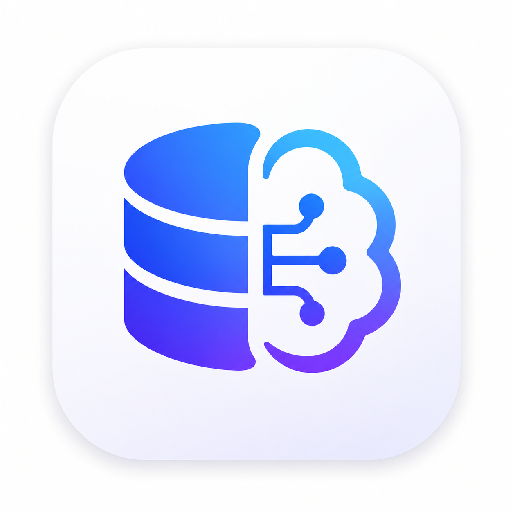

<p align="center">
  
</p>

<h1 align="center">DBMind</h1>

<p align="center">
  <strong>AI Native SQL Workspace</strong>
  <br />
  Built with Tauri · Rust · React · Monaco Editor
</p>

<p align="center">
  <a href="#download">Download</a> ·
  <a href="#features">Features</a> ·
  <a href="#development">Development</a> ·
  <a href="#architecture">Architecture</a> ·
  <a href="#license">License</a>
</p>

---

## Download

Download the latest installer from [GitHub Releases](https://github.com/Raymanhan/DBMind/releases).

| Platform | Package |
|----------|---------|
| macOS Apple Silicon | `DBMind_<version>_aarch64.dmg` |
| macOS Intel | `DBMind_<version>_x64.dmg` |
| Windows | `DBMind_<version>_x64-setup.exe` |
| Linux | `DBMind_<version>_amd64.AppImage` |

## Latest Release

### v0.2.4 — Tauri rewrite

DBMind has been fully rewritten from Electron to **Tauri v2 + Rust**, delivering dramatically smaller package size, lower memory usage, and faster startup.

**Editor & Query**

- **Persistent editor tabs** — SQL tabs survive app restarts via localStorage
- **Multi-statement execution** — Split `;`-delimited SQL and display each result in its own sub-tab with batch progress
- **Query history** — Auto-recorded query history with one-click replay
- **EXPLAIN plan viewer** — Visualize execution plans with summary and full table
- **Schema-aware autocomplete** — Table and column completion from live schema index
- **Error line highlighting** — SQL syntax errors are highlighted inline in the editor
- **Drag-and-drop tab reordering**
- **Save to `.sql` file** — Export editor content via native save dialog
- **Format SQL** — Keyword capitalization and indentation

**AI Assistant**

- **Natural language to SQL** — Schema-aware context with table mentions (`@db.table`)
- **SQL optimization & explanation** — Analyze existing SQL for performance and readability
- **Paste-aware context** — Pasted `@db.table` references are immediately resolved and pinned
- **Multi-provider support** — OpenAI, Ollama, and OpenAI-compatible APIs
- **Conversation persistence** — History and active conversation survive app restart

**Database Explorer**

- **Multi-database schema tree** — Select databases via checkboxes, browse `Database → Table → Column` hierarchy
- **Connection management** — Save multiple MySQL connections, expand/collapse per connection
- **Schema refresh** — On-demand schema sync to keep the autocomplete index current

**Results & Data**

- **Virtualized data grid** — Glide Data Grid for smooth scrolling over large result sets
- **Copy cells** — Built-in grid copy (Cmd+C)
- **Query metadata** — Row count, execution time, affected rows per statement

## Development

```bash
# Prerequisites
# - Rust toolchain (https://rustup.rs)
# - Node.js 18+
# - System dependencies for Tauri (see https://v2.tauri.app/start/prerequisites/)

# Install frontend dependencies
npm install

# Run in development mode (hot-reload)
npm run tauri:dev

# Type check
npm run typecheck

# Production build
npm run build

# Build platform installer
npm run tauri:build
```

> `npm run tauri:dev` starts both the Vite dev server and the Tauri desktop app.  
> `npm run tauri:build` produces the distributable installer in `src-tauri/target/release/bundle/`.

## Architecture

```
┌─────────────────────────────────────────────────┐
│                   Tauri Shell                    │
│  ┌───────────────────┐  ┌─────────────────────┐ │
│  │   React Frontend  │  │   Rust Backend       │ │
│  │   (Vite + TSX)    │◄─►  (Tauri Commands)    │ │
│  ├───────────────────┤  ├─────────────────────┤ │
│  │  Monaco Editor    │  │  dbmind-db          │ │
│  │  Glide Data Grid  │  │  dbmind-query       │ │
│  │  Zustand Stores   │  │  dbmind-schema      │ │
│  │  Lucide Icons     │  │  dbmind-sql         │ │
│  └───────────────────┘  │  dbmind-ai          │ │
│                         │  dbmind-cache       │ │
│                         └─────────────────────┘ │
└─────────────────────────────────────────────────┘
```

### Frontend (`src/`)

| Path | Purpose |
|------|---------|
| `features/connections/` | Connection tree with database checkboxes |
| `features/schema-tree/` | Database → Table → Column tree view |
| `features/editor/` | Monaco SQL editor, tab strip, toolbar |
| `features/result-grid/` | Virtualized data grid for query results |
| `features/ai-chat/` | AI assistant panel with conversation management |
| `features/navigation/` | Sidebar, left rail |
| `shared/stores/` | Zustand state (editor, connection, query, UI, chat) |
| `shared/api/` | Tauri IPC bridge (`invoke`) and shared types |
| `shared/hooks/` | React hooks (query execution, Tauri events) |

### Backend (`src-tauri/`)

| Crate | Purpose |
|-------|---------|
| `dbmind-db` | MySQL/PostgreSQL connection management and query execution |
| `dbmind-query` | High-level query service with cancellation and result caching |
| `dbmind-schema` | Schema index, DDL generation, table search |
| `dbmind-sql` | SQL formatting, splitting, validation, identifier quoting |
| `dbmind-ai` | AI chat gateway (OpenAI / Ollama / compatible) |
| `dbmind-cache` | In-memory query result store with cell-level fetch |
| `dbmind-core` | Shared traits, types, and error definitions |

### Data Flow

```
User types SQL ──► Monaco Editor ──► Cmd+Enter
    │
    ▼
Tauri IPC ──► execute_query (Rust)
    │
    ├── dbmind-sql::quote::quote_identifiers  (auto-fix hyphenated identifiers)
    ├── dbmind-sql::split::split_statements   (split by ;)
    ├── dbmind-sql::validate::validate_sql    (safety checks)
    │
    ▼
dbmind-db (MySQL driver) ──► Query Result
    │
    ▼
Tauri Event (query:ready) ──► React Store ──► ResultGrid
```

## Tech Stack

| Layer | Technology |
|-------|------------|
| Desktop Shell | Tauri v2 |
| Frontend | React 19 + TypeScript + Vite 7 |
| Backend | Rust (tokio + SQLx) |
| SQL Editor | Monaco Editor |
| Data Grid | Glide Data Grid |
| State | Zustand |
| Database Drivers | mysql_async (Rust) |
| AI Providers | OpenAI / Ollama / compatible |
| Packaging | Tauri Bundler (DMG, NSIS, AppImage) |

## License

[See LICENSE](LICENSE)

DBMind is provided for free download and use. Modification, redistribution, or hosted-service use is not permitted without authorization.
